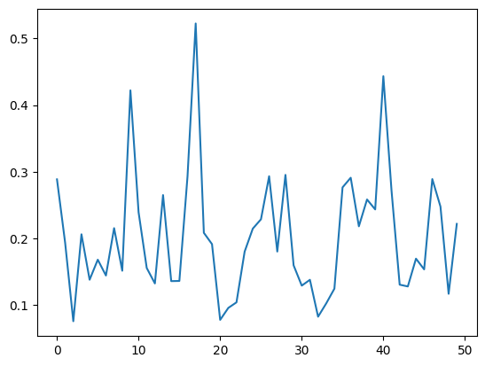
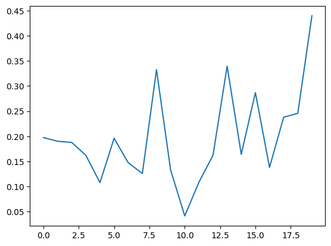
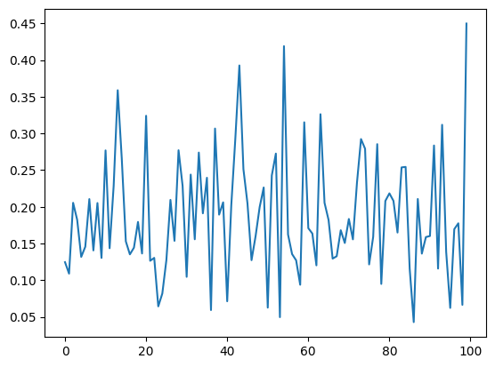
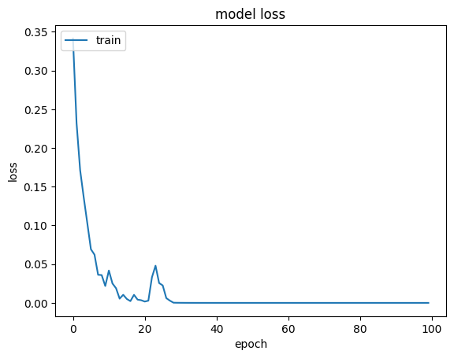
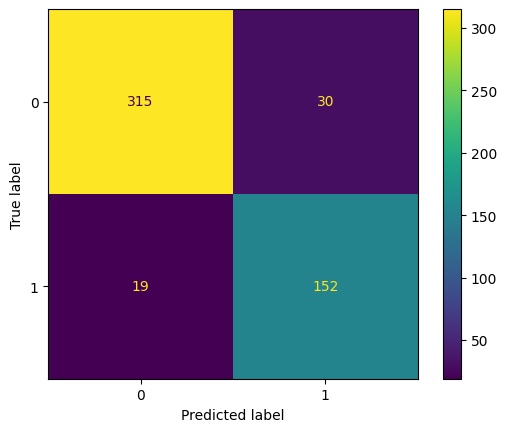
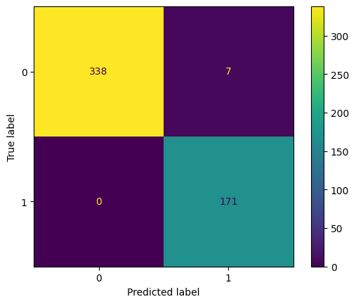

# Description

[MAHOMES](https://github.com/SluskyLab/MAHOMES) is a project done by the SLUSKY lab in the University of Kansas to distinguish between active and inactive metal-binding sites of proteins. The methodology is a variety of machine learning algorithms/tools that can be used individually, but haven't been designed in tandem. Overall, the models performed relatively well to other previous approaches, with 92.2% precision and 901% recall. One of their algorithms, MLP (Multilayer Perceptron), uses scikit-learn’s Multilayer Perceptron library. However, it happened to do relatively worse in MCC (Matthews Correlation Coefficient) and precision measures compared to other methods, but by 1 to 2 percent (no major gap in performance). Scikit-learn’s MLP is often used as a very surface-level MLP that doesn’t have many customization options, but has the advantage of near guaranteeing convergence, in this case, outputs of 0 and 1s for this binary classification. 
This project involves a lot of trial and error with using Pytorch and Tensorflow MLP model builders. The goal is to design a custom MLP that can be directly edited to adjust hidden layer features and activation functions, allowing more customization than scikit learn. In addition, while the model may not perform as well as scikit learn, it will achieve a decent accuracy and true negative rate in relation to MAHOMES scikit learn MLP, and there is plenty opportunitiy to further customize the model to improve the accuracy. The evaluation of the new custom MLP in comparison to MAHOMES MLP was done by tensorflow's confusion matrix and the Matthews Correlation Coefficient, among a few other evaluated parameters.

## Dataset Creation

The dataset is found in the data folder, in the file sites_calculated_features.txt. The other two csv files are scaled training and test versions of that overall data.
The data was borrowed from the MAHOMES github repository, and it contains various protein sites, their physical featurs (tabular values), and their catalytic/non-catalytic status as true/false. The catalytic status is the target of our machine learning.

The direct process by which the data was obtained can be found in the [MAHOMES I paper](https://www.nature.com/articles/s41467-021-24070-3). It was sourced from RCSB, filtered for quality and with metal atoms of similar crystal structure grouped together as one site. The most high quality data was sourced, redundant data filtered, and only unique residues of each site were represented in the data. Feature distribution is good (no lack of pocket and lining features, good representatin in the data) Overall, the dataset is a bit small (around 4000 total unique sites), and around 24% of the data is catalytic. 

# File organization

## Data folder

Contains data, and csv of training (data_scaled.csv) and testing (Tsites_scaled.csv) data sourced from sites_calculateed_features.txt

## colors.py

A small beautifyer for having colored text outputs to your colab notebook

## utils.py

General data wrangling, scaling, and model evaluation utilities (used in notebooks, and for ease of calling with your own custom scripts)

## MAHOMES.ipynb

This was sourced from the MAHOMES repository outlined above. Run the notebook to use an optimal scikit learn MLP and get accuracy and performance measures

##  MLP_trials.ipynb

A set of MLP trials for different kinds of basic MLP models, and towards the end, a performance comparison between the keras MLP and the scikit learn MAHOMES MLP

## Keras.py

Contains the final Keras custom MLP structure, and a function for evaluating it

# Running this project

You can run `MAHOMES.ipynb` to see how the model performs under that given dataset.
It scales the features, samples them, and runs a random seed for each iteration of the MLP model (default set to 10). You can save model files in a directory of choice. 
You can run a GridSearchCV opteration with scikit learn to find the optimal model parameters for the MLP for alpha values and numbers of hidden layers. After choosing the combo that has the greatest accuracy, you can run it on those params.

# Process and Results 

I ran the GridSearchCV on the MAHOMES MLP classifier for the given parameter combos, with the training and testing data being used as evaluation:
`{"hidden_layer_sizes": [(50,), (100,), (200,)], 
"alpha": [0.1, 0.01, 0.001]  }`

These combos were evaluated by their precision and accuracy measures. There are 9 combos, and each has had 7 folds in their model training and evaluation.

The results fpor each outer loop (of 7) were: 
0,0.001,"(100,)"
1,0.01,"(50,)"
2,0.001,"(200,)"
3,0.001,"(100,)"
4,0.001,"(200,)"
5,0.001,"(100,)"
6,0.001,"(100,)" 

There was no absolute concensus, but the most optimal parameters were `{'alpha': 0.001, 'hidden_layer_sizes': (100,)}`

The resultins of that input:
Accuracy        92.05
MCC             0.83
Recall	        93.57
TrueNegRate	    91.3
Precision       84.21

Then, I experimented with different pytorch MLP models in `MLP_tials.ipynb` I performed the same data wrangling and loaded the train and test data onto pytorch tensors. I tried a few different models with around 2 to 3 hidden layers and different actiation functions. However, I ran into an error of struggling to get the models to converge to a binary classification of 0 or 1, for false/true. Therefore, I went for the temporary evaluation of the different approaches by rmse and r2 scores.
All of thesee prototypes use pytorch's Adam optimizer for gradient descent and an L1 loss function.

Results of the basic prototypes:

### theiaMLP: 

2 hidden layer, uses tanh activation functions.

Mean Squared Error: 0.11795077403554882
R2 Score: 0.46766500127569677

Loss through epochs

### MLP (just a generic one)

2 hidden layers, RELU acivation, but sigmoid activation at end for final output
Mean Squared Error: 0.09783460591148274
 R2 Score: 0.5584532171244132

Loss through epochs

### ChurnModel (since it uses dropout)

sigmoid and relu activation functions, 2 hidden layers, batch normalization

Mean Squared Error: 0.09421305668796993
R2 Score: 0.5747979797344294 

It has by far the most unstable loss:

Ultimately, the structure of my model titled just MLP did relatively teh best. All 3 prototypes had very usntable loss functions, but MLP had the lowest mse and its R2 score was relatively close to 0.50, which is optimal (sice it's beetween 0 and 1)

For reference, MAHOMES MLP had the following:
Mean Squared Error: 0.10207024977596316
R2 Score: 0.5393369248437435

So, later in the MLP_trials notebook, I created a KerasClassifer model that uses a similar structure as my MLP model (2 hidden layers, 2 relu functions, sigmoid at the end)
It's loss function stabilized very well, and it was the closest to convergence (we're talking about values like 2e-12) I normalized the outputs to get 0s and 1s.
Loss function diagram: 

### Keras MLP performance comparison

Both the Keras classifier MLP and the scikit learn classifier MLP were trained over 100 epochs. 
I evaluted them by confusion matrix scores and overall accuracy

Keras confusion matrix:

Scikit Learn MAHOMES MLP confusion matrix:

Table for keras MLP evaluation:

Accuracy        98.643411
MCC             0.970145
Recall	        100.0
TrueNegRate	    97.971014
Precision      96.067416

Whereas for MAHOMES MLP (computed from MAHOMES.ipynb, as displayed above as well):
Accuracy        92.05
MCC             0.83
Recall	        93.57
TrueNegRate	    91.3
Precision       84.21

Overall, it seems that the scikit learn MLP did better in voiding false positives and true negatives (it had no false negatives!) However, the keras MLP was more precise and had a higher true negative rate, plus a better MCC (Matthews Correlation Coefficient) score.
Future testing can be done between the two MLPs, and I'll be sure ot look into other algorithms for determining the ideal hyperparameters of custom models.

# Credits

All credit of MAHOMES.ipynb to MAHOMES project (https://github.com/SluskyLab/MAHOMES) 
